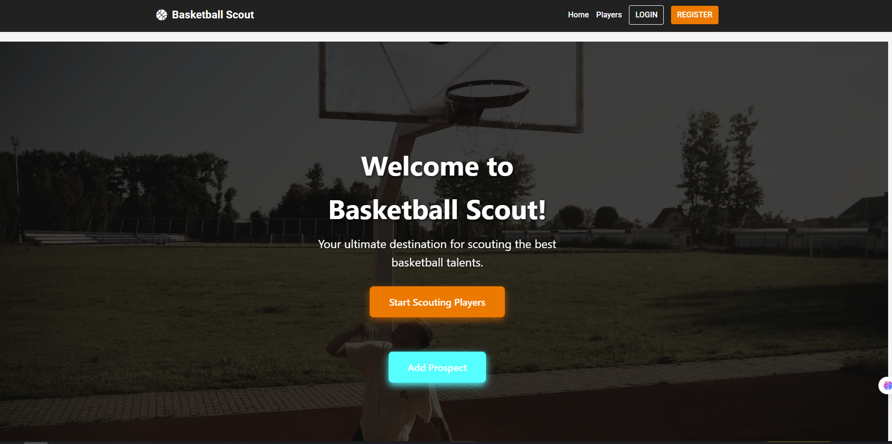

A modern Angular application for managing basketball player profiles and scouting them, built with a clean UI, responsive design, and MongoDB backend.  
Easily **create**, **edit**, **view**, and **like** player profiles.

---

## 🚀 Getting Started

Follow these steps to set up and run the project locally.

### 1️⃣ Prerequisites
Make sure you have the following installed:

- **Node.js** – _Latest LTS version recommended_ ([Download here](https://nodejs.org/))
- **npm** – comes with Node.js
- **Angular CLI** – Install globally:
  ```bash
  npm install -g @angular/cli
  ```
- **MongoDB &  – [Download here](https://www.mongodb.com/try/download/community)
and connect to the default host
- **MongoDB Tools & - [Download here](https://www.mongodb.com/try/download/database-tools)

## 🗄 Database Setup

## ❗ Initial data load(optional)
 If you want to load the database with initial players u can follow the following instructions:
 Go to the MongoDB Tools folder (usually something like):

```makefile
C:\Program Files\MongoDB\Tools\100\bin
Run the command from there, with the full path to your JSON file:

mongoimport --db forum --collection players --file "C:\Users\HP\Documents\AngularProject\forum\players.json" --jsonArray

❗ ❗ ❗ ❗ 
 Where C:\Users\HP\Documents\AngularProject\forum\players.json is the path to the players.json file which is in the forum folder of the project
❗ ❗ ❗ ❗ 
---
```


 2️⃣ Installation

Clone this repository:

https://github.com/e-dinkov/PracticalProject


Install dependencies:
```bash
npm install
```


### 3️⃣ Running the Project

#### ▶️ Start Angular development server
```bash
ng serve
```


#### ⚠️If it tells you that u cant run scripts run this comand in the basketball-forum directory 
```bash
Set-ExecutionPolicy -Scope CurrentUser Unrestricted
```
Open your browser at **http://localhost:4200**

#### ▶️ Start the backend server
```bash
npm start
```
This starts the Node.js/Express backend API.
 
 #### ▶️ Istall the backend server dependencies
```bash
npm i
```

---
---

✅ Database should now be ready.

---

## 📚 Features

- 👤 **Player Profiles** – Create, edit, and view detailed player info.
- 👍 **Like System** – Like your favorite players in real-time.
- 🔒 **Auth Guard** – Restrict edit/delete access to profile owners.
- 📱 **Responsive UI** – Optimized for desktop and mobile.
- 🎨 **Animations** – Smooth fade-in transitions for better UX.
- 🌐 **REST API** – Fast and secure backend integration.

---

## 📦 Libraries & Tools

- **Angular** – Frontend framework
- **RxJS** – Reactive programming
- **Signals** – Angular reactivity for likes
- **Express.js** – Backend framework
- **MongoDB** – NoSQL database
- **Bootstrap / Tailwind CSS** – Styling & layout
- **Framer Motion / CSS Animations** – Smooth UI transitions

---

## 📷 Screenshots

> _Replace the placeholders below with actual screenshots of your app UI._

### 🏠 Home Page


### 📄 Player Details


### ✏️ Players Board


---

## 📜 License

This project is licensed under the MIT License – feel free to modify and use.

---
```

